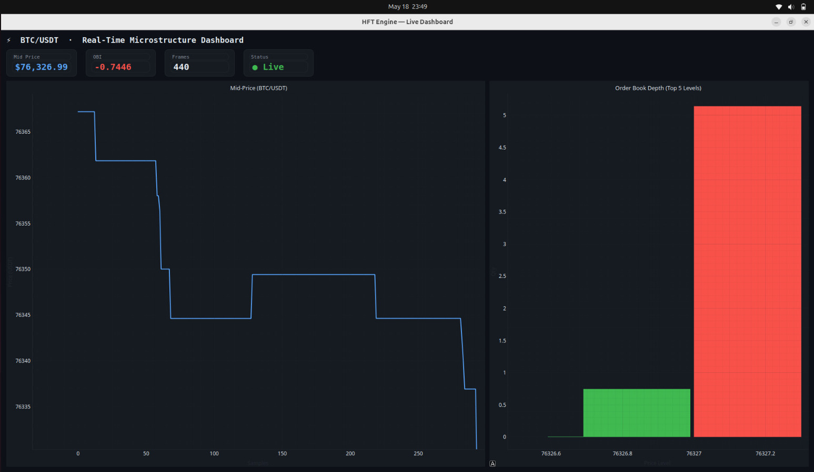

<div align="center">
  <h1>⚡ Hybrid C++/Python HFT Engine ⚡</h1>
  <p><strong>A high-frequency trading microstructure engine featuring a high-performance C++ core and a real-time Python visualization dashboard.</strong></p>
</div>

---

<p align="center">
  
</p>

## 📖 Overview

The **Hybrid HFT Microstructure Engine** bridges the gap between algorithmic programming and professional systems engineering. It leverages the raw speed of **C++** for market data ingestion and order book computations, while seamlessly communicating via **ZeroMQ** with a responsive **Python** analytics frontend for real-time visualization.

### ✨ Key Features

- **Blazing Fast C++ Core**: Built for low-latency processing, handling real-time WebSocket feeds from Binance.
- **Limit Order Book (LOB)**: Custom data structures to maintain and update the Top Bids and Asks on the fly.
- **Predictive Microstructure Features (PMF)**: Real-time calculation of Order Book Imbalance (OBI) to gauge buying/selling pressure and predict short-term price movements.
- **Inter-Process Communication (IPC)**: Reliable, non-blocking message passing using ZeroMQ (PUB/SUB pattern) between the C++ backend and Python frontend.
- **Real-Time Visualization Dashboard**: Built with PyQtGraph for ultra-fast, smooth plotting of live price movements, order book depth, and predictive metrics.

---

## 🏗️ Architecture

1. **Market Data Connector (WebSockets / C++)**
   Connects to the Binance Partial Book Depth stream (`wss://stream.binance.com:9443/ws/btcusdt@depth10@100ms`) using `ixwebsocket`. Parses raw JSON payloads into actionable data using `nlohmann-json`.

2. **Order Book & PMF Engine (C++)**
   Maintains the state of the order book. Computes the Order Book Imbalance:
   `OBI = (BidVol - AskVol) / (BidVol + AskVol)`

3. **IPC Bridge (ZeroMQ)**
   Packages the Mid-Price, OBI, and Top 5 Bids/Asks into a single JSON payload and streams it via a ZeroMQ Publisher socket (`tcp://127.0.0.1:5555`).

4. **Analytics Dashboard (Python / PyQtGraph)**
   A Python Subscriber thread continually listens for ZeroMQ updates. The main UI loop consumes these updates to refresh line charts (Mid-Price), bar graphs (LOB Volume), and dynamic gauges (OBI).

---

## 🚀 Getting Started

### Prerequisites

- **C++ Environment**: Compiler with C++17 support, CMake, and `vcpkg`.
- **Python Environment**: Python 3.8+ with `pip`.

### Dependencies

**C++ Packages (via vcpkg):**
- `nlohmann-json`
- `cppzmq`
- `ixwebsocket`

**Python Packages:**
- `pyzmq`
- `pyqtgraph`
- `PyQt6` (or equivalent Qt bindings)

### Build Instructions

1. **Compile the C++ Engine:**
   ```bash
   mkdir build && cd build
   cmake .. -DCMAKE_TOOLCHAIN_FILE=[path-to-vcpkg]/scripts/buildsystems/vcpkg.cmake
   make
   ```

2. **Set up the Python Dashboard:**
   ```bash
   python -m venv venv
   source venv/bin/activate
   pip install pyzmq pyqtgraph PyQt6
   ```

### Running the System

1. **Start the C++ Trading Engine:**
   ```bash
   ./build/trading_engine
   ```

2. **Launch the Real-Time Dashboard:**
   ```bash
   python dashboard/dashboard.py
   ```

---

<div align="center">
  <i>Engineered for speed, built for insight.</i>
</div>
