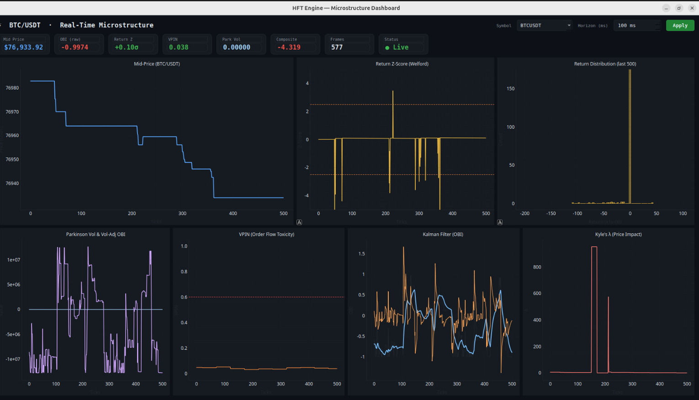

<div align="center">

# ⚡ Hybrid C++/Python HFT Engine

### A Professional-Grade Market Microstructure Research Platform

[](https://en.cppreference.com/w/cpp/17)
[](https://www.python.org/)
[](https://zeromq.org/)
[](https://binance.com)
[](https://cmake.org/)
[](LICENSE)

*Engineered for speed. Built for insight.*

</div>

---

<p align="center">
  
  <br/>
  <sub><i>Live dashboard running against the Binance BTC/USDT feed — 7 panels, 50ms refresh, ~497 ticks captured</i></sub>
</p>

---

## 📖 Overview

The **Hybrid HFT Microstructure Engine** is a full-stack quantitative trading research system that bridges the gap between theoretical market microstructure and production-grade systems engineering.

The architecture is intentionally split into two specialized runtimes:

- A **C++ backend** that ingests live Binance WebSocket data at sub-millisecond latency, maintains a real-time Limit Order Book, and runs a 5-layer quantitative signal stack.
- A **Python frontend** that subscribes to the signal stream via ZeroMQ and renders a 7-panel real-time analytics dashboard using PyQtGraph.

This project is not a black-box algorithmic trader — it is a **microstructure observatory**: a system for understanding *how* markets move, *who* is trading, and *why* prices change, all in real time.

---

## ✨ Feature Highlights

| Category | Feature | Details |
|---|---|---|
| 🚀 **Performance** | Sub-millisecond C++ Core | Lock-free data flow, compiled with `-O2`, no heap allocations on the hot path |
| 📡 **Connectivity** | Binance WebSocket | Partial Book Depth stream @ 100ms (`btcusdt@depth10@100ms`) via `ixwebsocket` |
| 📚 **Order Book** | Limit Order Book (LOB) | `std::map` with price-time priority for Bids (descending) and Asks (ascending) |
| 🔢 **Signal Layer 1** | Rolling Return Z-Score | Welford's online algorithm for numerically stable, real-time mean/variance estimation |
| 📉 **Signal Layer 2** | Parkinson Volatility | High-low range volatility estimator for intraday regime detection |
| ☣️ **Signal Layer 3** | VPIN | Volume-Synchronized Probability of Informed Trading (Easley, López de Prado, O'Hara 2012) |
| 🧠 **Signal Layer 4** | Kalman Filter (OBI) | Adaptive noise reduction on the raw Order Book Imbalance signal |
| 💧 **Signal Layer 5** | Kyle's Lambda | Measures price impact per unit of order flow — a real-time liquidity gauge |
| 🎲 **Signal Layer 6** | Predictive PDF | Location-Scale Student-t distribution fit to next-tick Δprice; outputs P(up), P(down), and directional edge |
| ⚡ **Composite Signal** | Multi-Factor Score | Combines all 6 layers into a single, gated trading signal |
| 🔗 **IPC** | ZeroMQ PUB/SUB | Non-blocking, high-throughput message passing at `tcp://127.0.0.1:5555` |
| 📊 **Dashboard** | 8-Panel Live View | PyQtGraph powered, 50ms refresh, dark-mode, colour-coded signal thresholds |

---

## 🏗️ System Architecture

```
┌─────────────────────────────────────────────────────────────────────┐
│                         C++ BACKEND  (trading_engine)               │
│                                                                     │
│  ┌─────────────┐    ┌──────────────┐    ┌─────────────────────┐    │
│  │  Binance    │    │  Limit Order │    │   6-Layer Signal    │    │
│  │  WebSocket  │───▶│  Book (LOB)  │───▶│       Stack         │    │
│  │  (100ms)    │    │              │    │                     │    │
│  └─────────────┘    │  bids: map   │    │  L1: Return Z-Score │    │
│                     │  asks: map   │    │  L2: Parkinson Vol  │    │
│   ixwebsocket       │              │    │  L3: VPIN           │    │
│   nlohmann/json     │  midPrice()  │    │  L4: Kalman OBI     │    │
│                     │  obi()       │    │  L5: Kyle's Lambda  │    │
│                     └──────────────┘    │  L6: Predictive PDF │    │
│                                         └──────────┬──────────┘    │
│                                                    │               │
│                                         ┌──────────▼──────────┐    │
│                                         │  Composite Signal   │    │
│                                         │  + JSON Payload     │    │
│                                         └──────────┬──────────┘    │
└────────────────────────────────────────────────────┼───────────────┘
                                                     │ ZeroMQ PUB
                                                     │ tcp://127.0.0.1:5555
┌────────────────────────────────────────────────────┼───────────────┐
│                        PYTHON FRONTEND  (dashboard.py)             │
│                                                     │               │
│                                         ┌──────────▼──────────┐    │
│                                         │   ZmqThread (SUB)   │    │
│                                         │   data_queue        │    │
│                                         └──────────┬──────────┘    │
│                                                    │               │
│  ┌──────────┬──────────┬────────────────┬──────────▼──────────┐    │
│  │ Panel 1  │ Panel 2  │    Panel 3     │  QTimer (50ms poll) │    │
│  │ Mid-Price│ Return Z │ Return Distrib.│                     │    │
│  ├──────────┼──────────┼────────────────┤  RollingBuffer[500] │    │
│  │ Panel 4  │ Panel 5  │    Panel 6     │                     │    │
│  │ Park Vol │  VPIN    │  Kalman OBI    │  PyQtGraph UI       │    │
│  ├──────────┼──────────┼────────────────┘                     │    │
│  │ Panel 7  │ Panel 8  │                                      │    │
│  │ Kyle's λ │ PDF Edge │                                      │    │
│  └──────────┴──────────┴──────────────────────────────────────┘    │
└─────────────────────────────────────────────────────────────────────┘
```

---

## 🔬 The 6-Layer Signal Stack

The heart of the engine is a sequential signal pipeline that transforms raw order book data into a calibrated composite trading score.

### Layer 1 — Return Z-Score `(welford.hpp)`

Tracks the tick-by-tick return distribution using **Welford's numerically stable online algorithm**. Each new return is expressed as a z-score relative to the rolling mean and standard deviation. Z-scores beyond **±2.5σ** indicate statistically anomalous price moves.

```
ret_t     = (mid_t - mid_{t-1}) / mid_{t-1}
z_t       = (ret_t - μ) / σ          # Welford rolling mean/stddev
```

### Layer 2 — Parkinson Volatility `(parkinson.hpp)`

Uses the **high-low range** (Best Ask / Best Bid) as a proxy for the intraday volatility estimator proposed by Parkinson (1980). More efficient than close-to-close estimators as it uses intra-period price extremes.

```
park_vol  = √( 1/(4·ln2) · ln²(ask/bid) )  # rolling average
```

The raw OBI is then **normalized by Parkinson Vol** to make it volatility-regime-aware:
`obi_normalized = obi_raw / park_vol`

### Layer 3 — VPIN `(vpin.hpp)`

Implements the **Volume-Synchronized Probability of Informed Trading** from Easley, López de Prado & O'Hara (2012). Because we receive LOB snapshots rather than individual trades, tick direction is classified via the **Lee-Ready rule**:

- `mid↑` → buyer-initiated (aggressive buyer lifted the ask)
- `mid↓` → seller-initiated (aggressive seller hit the bid)
- `mid=` → neutral (split 50/50)

VPIN is computed as a **rolling average over 50 volume buckets** (each 50 ticks). Values above **0.6** signal dangerously toxic order flow.

```
bucket_vpin = |buy_vol - sell_vol| / (buy_vol + sell_vol)
rolling_vpin = avg(last 50 bucket_vpins)
```

### Layer 4 — Kalman Filter `(kalman.hpp)`

Applies a **1D Kalman Filter** to the raw OBI signal to produce a smoothed estimate that adapts to changing market conditions without look-ahead bias. The innovation (prediction error) is also tracked and normalized as its own z-score.

```
prediction  = x̂_{t|t-1} = F·x̂_{t-1}
innovation  = z_t - H·x̂_{t|t-1}
update      = x̂_t = x̂_{t|t-1} + K_t · innovation
```

### Layer 5 — Kyle's Lambda `(kyle.hpp)`

Estimates the **price impact coefficient** (Kyle, 1985) — the cost of trading one unit of volume. A high lambda indicates an illiquid market where even small orders move prices significantly.

```
Δprice = λ · signed_volume + ε
λ       = OLS estimate (rolling window, online update)
```

### Layer 6 — Predictive PDF `(predictive_pdf.hpp)`

Models the **next-tick price change** as a **Location-Scale Student's t-distribution** — the theoretically correct choice for HFT returns, which are known to exhibit heavy tails that Gaussian models cannot capture.

In market microstructure, a short-term price move decomposes into a **deterministic drift** (driven by order flow imbalance and price impact) and a **stochastic diffusion** (driven by realized volatility). This layer fuses all upstream signals into a single probabilistic forecast:

```
x = ΔP_{t+Δt}  ~  t(μ, σ, ν)

μ  = λ_kyle · OBI_kalman · Δt          # drift: flow imbalance × impact × time
σ  = σ_parkinson · √Δt · (1 + VPIN)   # scale: vol widened by flow toxicity
ν  ∈ [3, 5]                            # degrees of freedom (tail thickness)
```

Why Student-t and not Gaussian? Because crypto microstructure is leptokurtic — returns have sharper peaks and fatter tails than a normal distribution. Using ν = 4 (default) gives an excess kurtosis of 6, which closely matches empirical BTC/USDT tick distributions.

The CDF is evaluated in closed form using the **regularised incomplete beta function** (Lentz continued fraction, O(1) per tick, no external dependencies). This yields exact uptick/downtick probabilities:

```
P(up)  = P(x > 0) = 1 - F_t(-μ/σ; ν)     # CDF evaluated at standardised threshold
P(dn)  = 1 - P(up)
edge   = P(up) - P(dn) = 2·P(up) - 1      # signed directional edge ∈ (-1, 1)
```

The `edge` output is the key actionable quantity: `edge > 0` implies a bullish lean, `edge < 0` a bearish one, and `|edge|` quantifies confidence.

### Composite Signal

The final signal gates the Kalman-smoothed OBI through three multiplicative factors:

```
composite = obi_kalman  ×  (1 - vpin)  ×  min(1/park_vol, 5.0)  ×  liq_gate
            [direction]    [toxicity]       [vol regime]            [liquidity]

liq_gate = 1.0  if kyle_lambda < 0.5 (liquid)
           0.5  otherwise             (illiquid penalty)
```

---

## 📊 Live Dashboard Panels

| Panel | Metric | Description |
|:---:|---|---|
| **1** | Mid-Price | Live BTC/USDT mid-market price time series |
| **2** | Return Z-Score | Tick returns normalized to ±σ units, with ±2.5σ alert lines |
| **3** | Return Distribution | Rolling 500-sample histogram with overlaid **Student-t PDF** fit (via `scipy`) |
| **4** | Parkinson Vol & OBI/Vol | Realized volatility (pale blue) vs. volatility-adjusted OBI (purple) |
| **5** | VPIN | Flow toxicity tracker with a **0.6 danger-zone** threshold line |
| **6** | Kalman OBI | Raw OBI (grey) vs. Kalman-smoothed OBI (blue) vs. Innovation (orange) |
| **7** | Kyle's Lambda | Market liquidity/impact coefficient — spikes indicate thin order books |
| **8** | Predictive PDF Edge | Rolling directional edge `P(up) - P(dn)` from the Student-t fit; ±0.5 threshold bands |

The top **stat bar** provides a live heads-up display with colour-coded values for Mid-Price, OBI, Return-Z, VPIN, Parkinson Vol, Composite Signal, and PDF Edge.

---

## 🚀 Getting Started

### Prerequisites

| Requirement | Version | Notes |
|---|---|---|
| C++ Compiler | GCC 10+ / Clang 12+ | C++17 standard required |
| CMake | 3.20+ | vcpkg ships a compatible version |
| vcpkg | latest | Used for all C++ dependencies |
| Python | 3.8+ | For the analytics dashboard |

### C++ Dependencies (via vcpkg)

```
nlohmann-json    # JSON parsing of Binance payloads
cppzmq           # ZeroMQ C++ bindings
ixwebsocket      # WebSocket client for Binance streams
```

### Python Dependencies

```
pyzmq            # ZeroMQ subscriber socket
pyqtgraph        # Ultra-fast real-time plotting
PyQt6            # Qt6 bindings for Python
scipy            # Optional — Student-t PDF fitting in return histogram
numpy            # Array operations for rolling buffers
```

---

## 🔧 Build & Run

### 1. Clone & Build the C++ Engine

```bash
git clone <your-repo-url>
cd hft-engine

# Build using the convenience script (uses vcpkg's bundled cmake)
chmod +x build.sh
./build.sh
```

Or manually with CMake:

```bash
cmake -B build -S . \
  -DCMAKE_TOOLCHAIN_FILE=./vcpkg/scripts/buildsystems/vcpkg.cmake
cmake --build build
```

### 2. Set Up the Python Dashboard

```bash
python -m venv venv
source venv/bin/activate
pip install pyzmq pyqtgraph PyQt6 scipy numpy
```

### 3. Run the System

Open **two terminals** and run in order:

```bash
# Terminal 1 — Start the C++ engine (connects to Binance, starts publishing)
./build/trading_engine
```

```bash
# Terminal 2 — Launch the Python dashboard
source venv/bin/activate
python dashboard/dashboard.py
```

The engine will print a live order book view to the terminal with all signal layers, while the dashboard renders the full graphical analytics view.

---

## 📁 Project Structure

```
hft-engine/
├── engine/
│   ├── main.cpp                   # Entry point — orchestrates all components
│   ├── orderbook/
│   │   ├── orderbook.hpp          # LOB data structure & JSON serialization
│   │   └── orderbook.cpp
│   ├── analytics/
│   │   ├── analytics.hpp          # SignalState struct — shared data model
│   │   ├── welford.hpp            # Layer 1: Welford online mean/variance
│   │   ├── parkinson.hpp          # Layer 2: Parkinson volatility estimator
│   │   ├── vpin.hpp               # Layer 3: VPIN order flow toxicity
│   │   ├── kalman.hpp             # Layer 4: 1D Kalman filter on OBI
│   │   ├── kyle.hpp               # Layer 5: Kyle's lambda (price impact)
│   │   └── predictive_pdf.hpp     # Layer 6: Location-Scale Student-t PDF
│   ├── publisher/
│   │   └── publisher.hpp          # ZeroMQ PUB socket wrapper
│   └── websocket/
│       ├── wb.hpp                 # ixwebsocket client wrapper
│       └── wb.cpp
├── dashboard/
│   ├── dashboard.py               # 7-panel PyQtGraph analytics dashboard
│   └── requirements.txt           # Python dependency list
├── CMakeLists.txt                 # Build configuration
├── build.sh                       # Convenience build script
├── vcpkg/                         # C++ package manager (submodule)
└── live_view.png                  # Dashboard screenshot
```

---

## 📚 Academic References

| Model | Paper |
|---|---|
| VPIN | Easley, D., López de Prado, M. M., & O'Hara, M. (2012). *Flow Toxicity and Liquidity in a High-Frequency World.* Review of Financial Studies. |
| Kyle's Lambda | Kyle, A. S. (1985). *Continuous Auctions and Insider Trading.* Econometrica, 53(6), 1315–1335. |
| Parkinson Vol | Parkinson, M. (1980). *The Extreme Value Method for Estimating the Variance of the Rate of Return.* Journal of Business. |
| Kalman Filter | Kalman, R. E. (1960). *A New Approach to Linear Filtering and Prediction Problems.* Journal of Basic Engineering. |
| Welford's Algorithm | Welford, B. P. (1962). *Note on a Method for Calculating Corrected Sums of Squares and Products.* Technometrics. |
| Student-t Microstructure | Cont, R. (2001). *Empirical properties of asset returns: stylized facts and statistical issues.* Quantitative Finance, 1(2), 223–236. |
| Incomplete Beta (CDF) | Press, W. H. et al. (2007). *Numerical Recipes: The Art of Scientific Computing (3rd ed.)* §6.4. Cambridge University Press. |

---

<div align="center">
  <sub>Built from first principles. No black boxes.</sub>
  <br/>
  <sub>C++ for speed · Python for insight · ZeroMQ for everything in between.</sub>
</div>
